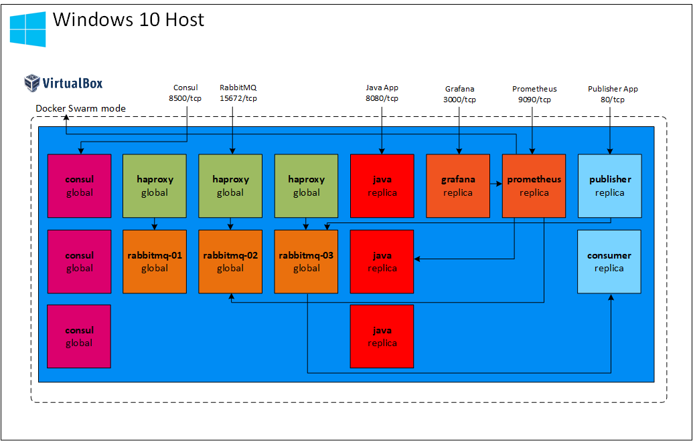
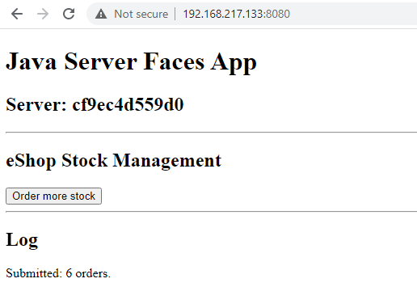

Docker Swarm Monitoring
=======================

### Table of Contents

- [Introduction](#introduction)
- [Service architecture](#services-architecture)
- [Getting started](#getting-started)
  * [Windows host PowerShell access](#windows-host-powershell-access)
- [Service deployment](#service-deployment)
  * [TLDR automated](#tldr-automated)
  * [Docker network](#docker-network)
  * [Consul deployment](#consul-deployment)
  * [RabbitMQ deployment](#rabbitmq-deployment)
  * [HAProxy deployment](#haproxy-deployment)
  * [Java app deployment](#java-app-deployment)
  * [Prometheus and Grafana deployment](#prometheus-and-grafana-deployment)
  * [Message queue publisher deployment](#message-queue-publisher-deployment)
  * [Message queue consumer deployment](#message-queue-consumer-deployment)
- [References](#references)
  * [RabbitMQ](#rabbitmq)
  * [Prometheus](#prometheus)


### Introduction

This repository is a result of some learning and investigation I performed into some technologies that were mostly new to me, namely:

* [Docker Swarm mode](https://docs.docker.com/engine/swarm/)
* [Consul](https://www.consul.io/)
* [RabbitMQ](https://www.rabbitmq.com/)
* [HAProxy](http://www.haproxy.org/)
* [Prometheus](https://prometheus.io/)
* [Grafana](https://grafana.com/oss/grafana/)
* [Java Apps](https://www.java.com)

The focus is on Prometheus and Grafana working in combination with each other to display metrics in dashboards.

The code in this project is meant to be deployed onto a Docker Swarm mode cluster that was previously deployed using [tonyskidmore/docker-swarm](https://github.com/tonyskidmore/docker-swarm).  Although that Docker swarm deployment here is hosted on a Windows 10 system running Vagrant and a few other requirements, the code in this repo can be deployed directly from a Linux system also.  Although not covered in detail here it was originally created and tested in a purely Linux environment.

In this lab style environment it is intended that each service is deployed to the Docker Swarm cluster as stacks by a series of separate [docker compose](https://docs.docker.com/compose/) files.  These are layered with the intention of taking a step at a time to review the different applications as they are deployed onto the cluster.  The series in which these are intended to be deployed are:

1. Consul
2. RabbitMQ
3. HAProxy
4. Java app
5. Prometheus and Grafana
6. Messaging publishing service
7. Messaging consumer service

Content published by [Ahmet Vehbi Olgaç](https://www.linkedin.com/in/ahmetvehbiolgac/?originalSubdomain=tr) and [Marcel Dempers](https://www.linkedin.com/in/marceldempers/?originalSubdomain=au) and courses on [Pluralsight](https://www.pluralsight.com) by [Elton Stoneman](https://www.linkedin.com/in/eltonstoneman/?originalSubdomain=uk) really helped me a lot as the basis of the content of this repo (see section the [References](#references)).

_Note_:  
None of the deployments are meant to describe how these products should be deployed in a Production or any other type of environment.  The aim is just to show from a high-level perspective how these products work and how some of them can be monitored.  

### Services architecture


The layout above represents a high-level view of the services that will be deployed and the externally accessible ports from the Windows host system.  It also shows the monitoring scraping communication lines from Prometheus to: Docker Swarm nodes, RabbitMQ cluster nodes and the Java application.  Grafana is shown using Prometheus as a data source.

### Getting started

The first step is to ensure that the Docker Swarm mode cluster has been deployed as per the [tonyskidmore/docker-swarm](https://github.com/tonyskidmore/docker-swarm) project.  A differently deployed Docker swarm cluster can be used if desired but references to the specifics of that cluster will need to be adjusted. 

If you are following along with the initial cluster deployment and then moving here perform the following steps on you Windows 10 host:  

````powershell

cd \vagrant

git clone https://github.com/tonyskidmore/docker-swarm-monitoring.git

cd docker-swarm-monitoring

````

#### Windows host PowerShell access
The default Docker Swarm mode cluster has been deployed in such a way that access to it from the Windows host is made via unencrypted communication to to the Docker Swarm manager node (`192.168.217.133:2375`).  It is necessary to set environment variables in any PowerShell session so this works:

````powershell
$env:DOCKER_HOST="192.168.217.133:2375"
$env:DOCKER_TLS_VERIFY=""

docker node ls
ID                            HOSTNAME            STATUS              AVAILABILITY        MANAGER STATUS      ENGINE VERSION
qmh74hjo5djwwzqa7jkyknisb *   docker-swarm-01     Ready               Active              Leader              19.03.13
fu8kqvcxfuficfi1ld0owy0l6     docker-swarm-02     Ready               Active                                  19.03.13
ydqqjvpshir1nhss6surd11kr     docker-swarm-03     Ready               Active                                  19.03.13

````
If your output is similar to the above then you are good to go.

### Service deployment

#### TLDR automated

The [Start-SwarmApps.ps1](https://github.com/tonyskidmore/docker-swarm-monitoring/blob/main/Start-SwarmApps.ps1) PowerShell script can be used interactively or ran from a PowerShell prompt on the Windows 10 host to drive all of the deployments.  The script needs some refactoring but for now it has worked in testing.  Further below are the more individual and generic steps that can be performed to deploy the application stacks.  There are some tidbits amongst the more detailed steps along with some further descriptions.  Be sure to review the `docker-compose-*.yml` files being deployed along with any associated product configuration files.

If you wanted to just deploy everything in one go then you can execute the following:

````powershell

cd c:\vagrant\docker-swarm-monitoring
.\Start-SwarmApps.ps1

````
If there are no issues then the script should deploy all of the services shown in the [Services layout](#services-layout) section, opening a browser to each as it goes.  Click on the script window to refocus on the script.  You can run with the `-OpenBrowser $false` parameter to avoid the browser functionality if desired.  

_Note_:  
PowerShell script execution has to be allowed on your system to be able to run scripts.  To allow script execution, if not already enabled, run PowerShell as Administrator and run the following prior to running the instructions above:  

````powershell

Set-ExecutionPolicy -ExecutionPolicy RemoteSigned -Force

````

#### Docker network

The services being deployed in this repo are targeting a network called `test` so this to be created first:

```` powershell

docker network create --driver=overlay --attachable test
c6bzyhnfpcapbrnjtydznmsvc

docker network ls
NETWORK ID          NAME                DRIVER              SCOPE
0a65fa8b26c5        bridge              bridge              local
d8191f32e336        docker_gwbridge     bridge              local
28c6d06a3dc9        host                host                local
vfy3m29793sq        ingress             overlay             swarm
3bce52d11586        none                null                local
c6bzyhnfpcap        test                overlay             swarm

````

#### Consul deployment

The first service to be deployed is Consul.  This will provide the service discovery for the RabbitMQ cluster.  

Assuming that the host you are running the docker commands on has the required binaries installed (e.g. the Windows host with Docker Toolbox installed) and the required environment variables set (see [Windows host PowerShell access](#windows-host-powershell-access)) then to deploy the Consul stack change to the location of this cloned repository and run:

````powershell

docker stack deploy -c docker-compose-consul.yml consul

````

After deployment check that the service was deployed checking that the commands below contain something similar to the example output below:

````powershell

docker stack services consul
ID                  NAME                MODE                REPLICAS            IMAGE               PORTS
ID                  NAME                MODE                REPLICAS            IMAGE               PORTS
2wamsz17spvs        consul_consul       global              3/3                 consul:1.7.9        *:8400->8400/tcp, *:8500->8500/tcp, *:8600->8600/tcp

docker stack ps consul
ID                  NAME                                      IMAGE               NODE                DESIRED STATE       CURRENT STATE                ERROR               PORTS
qviwseufg9f6        consul_consul.fu8kqvcxfuficfi1ld0owy0l6   consul:1.7.9        docker-swarm-02     Running             Running about a minute ago
tr79t27j23rj        consul_consul.qmh74hjo5djwwzqa7jkyknisb   consul:1.7.9        docker-swarm-01     Running             Running about a minute ago
yl6xbs12px2l        consul_consul.ydqqjvpshir1nhss6surd11kr   consul:1.7.9        docker-swarm-03     Running             Running about a minute ago

````

You can validate the status of the Consul cluster status from the command line:

````powershell

# check status of leader election
(Invoke-WebRequest -Uri 192.168.217.133:8500/v1/status/leader -UseBasicParsing).Content
"10.0.2.4:8300"

# verify active peers
(Invoke-WebRequest -Uri 192.168.217.133:8500/v1/status/peers -UseBasicParsing).Content
["10.0.2.5:8300","10.0.2.4:8300","10.0.2.3:8300"]

````
or in bash:

````bash

# check status of leader election
curl 192.168.217.133:8500/v1/status/leader
"10.0.2.4:8300"

# verify active peers
curl 192.168.217.133:8500/v1/status/peers
["10.0.2.4:8300","10.0.2.5:8300","10.0.2.3:8300"]

````

You should now be able to access the Consul UI from the Windows host via http://192.168.217.133:8500/.  The Consul Service should appear under the Services tab, all with successful Health Checks.  Under Nodes all nodes should be listed under Healthy Nodes, with a star badge indicating the leader.

#### RabbitMQ deployment

The first thing to mention prior to moving onto deploying the RabbitMQ cluster is mention [Monitoring with Prometheus & Grafana](https://www.rabbitmq.com/prometheus.html).  This is excellent information detailing all aspects of monitoring Rabbit MQ with Prometheus.  The [Quick Start](https://www.rabbitmq.com/prometheus.html#quick-start) is highly recommended to run through to see what is possible with RabbitMQ, Prometheus and Grafana.  We have taken the `RabbitMQ-Overview` dashboard from that repository and included it as part of this project to demonstrate how a dashboard can be automatically deployed.  I would also point you in the direction of the session hosted by Gerhard Lazu & Michal Kuratczyk from the RabbitMQ Summit 2019 (see [References](#references)).  

Following on from the previous Consul deployment we will now deploy the RabbitMQ cluster.  To begin with we will label the Docker Swarm nodes so that placement occurs as desired.  For example, the `rabbitmq-01` configuration will be deployed to the node with label `rabbitmq1`.  We can label the nodes and validate that these have been applied as follows:


````powershell

# label each node for placement rule
1..3 | % { & docker node update --label-add "rabbitmq$_=true" "docker-swarm-0$_" }
docker-swarm-01
docker-swarm-02
docker-swarm-03

# check that labels have been applied as expected, in order
1..3 | % { (docker inspect "docker-swarm-0$_" | ConvertFrom-Json).Spec.Labels | ConvertTo-Json }
{
    "rabbitmq1":  "true"
}
{
    "rabbitmq2":  "true"
}
{
    "rabbitmq3":  "true"
}

````

Now that the labels have been allocated for placement we deploy the RabbitMQ stack:

````powershell

docker stack deploy -c docker-compose-rabbitmq.yml rabbitmq

````

We can validate validate the deployment. This can take a few moments for the expected 1/1 REPLICAS to be displayed so retry the command until that state is in effect:

````powershell

docker stack services rabbitmq
ID                  NAME                   MODE                REPLICAS            IMAGE                       PORTS
998kdxiqwt4z        rabbitmq_rabbitmq-02   global              1/1                 rabbitmq:3.8.9-management
rg4ffk5syvxm        rabbitmq_rabbitmq-01   global              1/1                 rabbitmq:3.8.9-management
sljwr1n8abfj        rabbitmq_rabbitmq-03   global              1/1                 rabbitmq:3.8.9-management

docker stack ps rabbitmq
ID                  NAME                                             IMAGE                       NODE                DESIRED STATE       CURRENT STATE                ERROR               PORTS
5l1afiv1o1uu        rabbitmq_rabbitmq-02.fu8kqvcxfuficfi1ld0owy0l6   rabbitmq:3.8.9-management   docker-swarm-02     Running             Running about a minute ago
2khcfvfivmz0        rabbitmq_rabbitmq-01.qmh74hjo5djwwzqa7jkyknisb   rabbitmq:3.8.9-management   docker-swarm-01     Running             Running about a minute ago
vujetjx6muqf        rabbitmq_rabbitmq-03.ydqqjvpshir1nhss6surd11kr   rabbitmq:3.8.9-management   docker-swarm-03     Running             Running about a minute ago

````

The RabbitMQ cluster has now been deployed but because it is placed behind HAProxy we cannot access it until that service has been deployed.

#### HAProxy deployment

HAProxy can be deployed in a similar fashion to the previous service stacks:  

````powershell

docker stack deploy -c docker-compose-haproxy.yml haproxy

````

validate the deployment, waiting for `REPLICAS` be in the desired state of `3/3`:

````powershell

docker stack services haproxy
ID                  NAME                MODE                REPLICAS            IMAGE                  PORTS
eio9bx9mtser        haproxy_haproxy     global              3/3                 haproxy:2.3.0-alpine   *:1936->1936/tcp, *:5672->5672/tcp, *:15672->15672/tcp

docker stack ps haproxy
ID                  NAME                                        IMAGE                  NODE                DESIRED STATE       CURRENT STATE                ERROR               PORTS
u0dsfxxp09qq        haproxy_haproxy.ydqqjvpshir1nhss6surd11kr   haproxy:2.3.0-alpine   docker-swarm-03     Running             Running about a minute ago
mabdfp8x2qfe        haproxy_haproxy.fu8kqvcxfuficfi1ld0owy0l6   haproxy:2.3.0-alpine   docker-swarm-02     Running             Running about a minute ago
zfalsvyx5p39        haproxy_haproxy.qmh74hjo5djwwzqa7jkyknisb   haproxy:2.3.0-alpine   docker-swarm-01     Running             Running about a minute ago

````

We can validate that RabbitMQ is accessible via HAProxy with a simple PowerShell command, which should return `StatusCode: 200`:

````powershell

Invoke-WebRequest -Uri "http://192.168.217.133:15672" -UseBasicParsing
StatusCode        : 200
StatusDescription : OK
Content           : <!DOCTYPE html>
                    <html>
                      <head>
                        <meta http-equiv="X-UA-Compatible" content="IE=edge" />
                        <meta http-equiv="Content-Type" content="text/html; charset=utf-8" />
                        <title>RabbitMQ Management</ti...
RawContent        : HTTP/1.1 200 OK
                    content-security-policy: script-src 'self' 'unsafe-eval' 'unsafe-inline'; object-src 'self'
                    vary: origin
                    Content-Length: 2884
                    Content-Type: text/html
                    Date: Wed, 18 Nov 2020 20:15:...
Forms             :
Headers           : {[content-security-policy, script-src 'self' 'unsafe-eval' 'unsafe-inline'; object-src 'self'], [vary, origin], [Content-Length, 2884], [Content-Type, text/html]...}
Images            : {}
InputFields       : {}
Links             : {}
ParsedHtml        :
RawContentLength  : 2884

````
We should now be able to access the RabbitMQ UI using the URL http://192.168.217.133:15672 from the Windows host.  The default credentials are `Username: guest` and `Password: guest`.  Once logged in, the 3 nodes should appear in the Overview tab under the Nodes section.

#### Java app deployment

In an attempt to demonstrate gathering some very basic Java virtual machine(JVM) and Tomcat metrics we will deploy a simple Java application.  The demo app is a bit flakey but is serves a purpose.  I have been looking to add something a bit more interesting but have not got round to that just yet, something on the lines of [Monitoring Spring Boot Apps with Micrometer, Prometheus, and Grafana](https://stackabuse.com/monitoring-spring-boot-apps-with-micrometer-prometheus-and-grafana/) maybe.  Maybe you can try that?  

Anyway for now we will deploy what we have:   

````powershell

docker stack deploy -c docker-compose-java.yml java

````
wait for the service to come up:
````powershell

docker stack services java
ID                  NAME                MODE                REPLICAS            IMAGE                  PORTS
x06apyuc7sm7        java_java           replicated          3/3                 tonyskidmore/java:v1   *:8080->8080/tcp


docker stack ps java
ID                  NAME                IMAGE                  NODE                DESIRED STATE       CURRENT STATE                ERROR               PORTS
6ss6vlr5dyhu        java_java.1         tonyskidmore/java:v1   docker-swarm-03     Running             Running about a minute ago
fwbcbj0f7q0w        java_java.2         tonyskidmore/java:v1   docker-swarm-02     Running             Running about a minute ago
6ns2vhs11tl8        java_java.3         tonyskidmore/java:v1   docker-swarm-01     Running             Running about a minute ago

````

We can throw a little activity at the Tomcat server to see some activity when we get onto monitoring:

````powershell

for ($i=1 ;$i -lt 40 ; $i++) {  Invoke-WebRequest -Uri http://192.168.217.133:8080/ -UseBasicParsing | Out-Null }

````

or in bash:

````bash

for ((i=1;i<=40;i++)); do curl -s http://192.168.217.133:8080/ > /dev/null; done

````

Access the application in a browser using the URL http://192.168.217.133:8080 and click the `Order more stock` button a few times.  If an error is display just refresh the base URL and try again.  This is to generate some application level metrics.




#### Prometheus and Grafana deployment

#### Message queue publisher deployment

#### Message queue consumer deployment


### References

#### RabbitMQ

[Monitoring with Prometheus & Grafana](https://www.rabbitmq.com/prometheus.html)

[Implementing Highly Available RabbitMQ Cluster on Docker Swarm using Consul-based Discovery](https://medium.com/hepsiburadatech/implementing-highly-available-rabbitmq-cluster-on-docker-swarm-using-consul-based-discovery-45c4e7919634) by Ahmet Vehbi Olgaç  

[RabbitMQ : Message Queues for beginners](https://www.youtube.com/watch?v=hfUIWe1tK8E) by Marcel Dempers  

[RabbitMQ : How to setup a RabbitMQ cluster - for beginners](https://www.youtube.com/watch?v=FzqjtU2x6YA) by Marcel Dempers  

[Observe and understand RabbitMQ](https://www.youtube.com/watch?v=L-tYXpirbpA) by Gerhard Lazu & Michal Kuratczyk  

#### Prometheus

[Getting Started with Prometheus (Pluralsight)](https://app.pluralsight.com/library/courses/getting-started-prometheus) by Elton Stoneman  

[Monitoring Containerized Application Health with Docker (Pluralsight)](https://app.pluralsight.com/library/courses/monitoring-containerized-app-health-docker/table-of-contents) by Elton Stoneman

